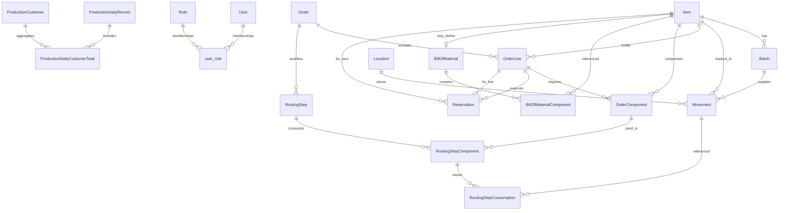

# Database Schema Overview

This guide summarizes the structure of the Hyperion Operations Hub database. It highlights the core tables, their key fields, and how the different areas of the system (inventory, production, work orders, and authentication) link together.

## Entity-Relationship Diagram

> **Note:** `user_role` is an association table that links users and roles in a many-to-many relationship.

## Table Reference

### Production & Reporting

- **`production_chart_settings`**
  - `id` (PK)
  - `primary_min`, `primary_max`, `primary_step` – numeric range configuration for the primary axis.
  - `secondary_min`, `secondary_max`, `secondary_step` – numeric range configuration for the secondary axis.
  - `goal_value` – optional numeric goal indicator.
  - `show_goal` – flag indicating whether the goal line is displayed.
  - `show_trendline` – toggle to overlay a weekday trendline on the production chart.
  - `show_output_per_hour` – toggle to plot the calculated output per labor hour overlay.

- **`production_daily_record`**
  - `id` (PK)
  - `entry_date` – unique production date.
  - `day_of_week` – localized weekday label.
  - Labor and throughput metrics: `gates_employees`, `gates_hours_ot`, `controllers_4_stop`, `controllers_6_stop`, `door_locks_lh`, `door_locks_rh`, `operators_produced`, `cops_produced`, `additional_employees`, `additional_hours_ot`.
  - `daily_notes` – optional commentary field.
  - Timestamps: `created_at`, `updated_at`.
  - Relationships: one-to-many `customer_totals`.

- **`production_daily_customer_total`**
  - `id` (PK)
  - `record_id` – FK to `production_daily_record.id`.
  - `customer_id` – FK to `production_customer.id`.
  - Metrics: `gates_produced`, `gates_packaged`.
  - Unique constraint per record/customer pair.

- **`production_customer`**
  - `id` (PK)
  - `name` – unique label.
  - `color` – hex code for charting.
  - Flags: `is_active`, `is_other_bucket`, `lump_into_other`.
  - Relationships: one-to-many `totals`.

- **`production_output_formula`**
  - `id` (PK)
  - `formula` – textual expression used for dashboards.
  - `variables` – JSON array of required inputs.
  - Audit fields: `created_at`, `updated_at`.

### Inventory Management

- **`item`**
  - `id` (PK)
  - `sku` – unique part number.
  - `name`
  - `type`
  - `unit` – defaults to `"ea"`.
  - `description`
  - `min_stock`
  - `notes`
  - Pricing: `list_price`, `last_unit_cost`.
  - Classification: `item_class`.

- **`location`**
  - `id` (PK)
  - `code` – unique warehouse location identifier.
  - `description`

- **`batch`**
  - `id` (PK)
  - `item_id` – FK to `item.id`.
  - `lot_number`
  - `quantity`
  - `received_date`

- **`movement`**
  - `id` (PK)
  - `item_id` – FK to `item.id`.
  - `batch_id` – optional FK to `batch.id`.
  - `location_id` – FK to `location.id`.
  - `quantity`
  - `movement_type` – e.g., receipt, issue, move, adjust.
  - `person`
  - `po_number`
  - `reference`
  - `date`

- **`work_instruction`**
  - `id` (PK)
  - `filename` – stored file reference.
  - `original_name` – upload name.
  - `uploaded_at`

### Work Orders & Manufacturing

- **`order`**
  - `id` (PK)
  - `order_number` – unique external reference.
  - `status` – tracked via `OrderStatus` enum.
  - `customer_name`
  - `created_by`
  - `general_notes`
  - Schedule fields: `promised_date`, `scheduled_start_date`, `scheduled_completion_date` (with validation constraints).
  - Audit fields: `created_at`, `updated_at`.
  - Relationships: one-to-many `order_lines` and `routing_steps`.

- **`order_item` (OrderLine)**
  - `id` (PK)
  - `order_id` – FK to `order.id`.
  - `item_id` – FK to `item.id`.
  - `quantity`
  - Schedule dates: `promised_date`, `scheduled_start_date`, `scheduled_completion_date` (with validation constraints).
  - Relationships: one-to-many `components` and `reservations`.

- **`order_bom_component` (OrderComponent)**
  - `id` (PK)
  - `order_item_id` – FK to `order_item.id`.
  - `component_item_id` – FK to `item.id`.
  - `quantity`
  - Unique per order line/component pair.

- **`item_bom` (BillOfMaterial)**
  - `id` (PK)
  - `item_id` – FK to `item.id` (unique one-to-zero/one association).
  - Audit fields: `created_at`, `updated_at`.

- **`item_bom_component` (BillOfMaterialComponent)**
  - `id` (PK)
  - `bom_id` – FK to `item_bom.id`.
  - `component_item_id` – FK to `item.id`.
  - `quantity`
  - Unique per BOM/component pair.

- **`order_step` (RoutingStep)**
  - `id` (PK)
  - `order_id` – FK to `order.id`.
  - `sequence` – step ordering (unique per order).
  - `work_cell`
  - `description`
  - `completed`
  - `completed_at`

- **`order_step_component` (RoutingStepComponent)**
  - `id` (PK)
  - `order_step_id` – FK to `order_step.id`.
  - `order_bom_component_id` – FK to `order_bom_component.id`.
  - Unique per routing step / component pair.

- **`order_step_consumption` (RoutingStepConsumption)**
  - `id` (PK)
  - `order_step_component_id` – FK to `order_step_component.id`.
  - `movement_id` – FK to `movement.id`.
  - `quantity`
  - `created_at`

- **`reservation`**
  - `id` (PK)
  - `order_item_id` – FK to `order_item.id`.
  - `item_id` – FK to `item.id`.
  - `quantity`
  - `created_at`

### Authentication & Authorization

- **`user`**
  - `id` (PK)
  - `username` – unique login name.
  - `password_hash`
  - `created_at`, `updated_at`

- **`role`**
  - `id` (PK)
  - `name` – unique role identifier.
  - `description`

- **`user_role`** (association table)
  - `user_id` – FK to `user.id`, part of composite PK.
  - `role_id` – FK to `role.id`, part of composite PK.

## Relationship Summary

- Inventory items flow from receipts (`movement`) into tracked batches and storage locations, and are referenced by work orders, BOMs, and reservations.
- Production records capture daily throughput per customer and roll up into chart settings and optional output formulas.
- Work orders (`order`) are composed of line items, which may reserve stock and consume BOM components across routing steps.
- Routing components reference both the BOM-defined requirements and the actual material movements that fulfill them.
- User and role tables enforce access control through the `user_role` join table.

Use this document alongside the application code to understand how data moves through the system during receiving, production scheduling, and execution.
