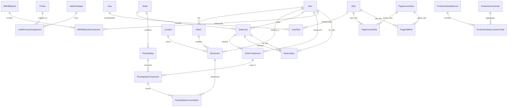

# Database Schema Overview

This document summarizes the database structure that powers the Hyperion
Operations Hub. It highlights the core tables, their key fields, and how the
inventory, production, workstation, and access-control domains intersect.

---

## Entity-Relationship Diagram

> **Note:** Association tables such as `user_role`, `page_access_role`, and
> `page_edit_role` enable many-to-many relationships between users, roles, and page
> permissions.

---

## Table Reference

### Inventory Management

- **`item`** – Core catalog entry storing SKU, description, min stock, pricing,
  and classification data.
- **`item_attachment`** – Uploaded documents or drawings linked to an item.
- **`location`** – Warehouse/bin codes and descriptions.
- **`batch`** – Lot-controlled inventory details (quantity, supplier, dates,
  notes) per item.
- **`movement`** – Full audit trail of receipts, issues, adjustments, and
  transfers. References the item, batch, location, quantity, and metadata such as
  `movement_type`, `person`, and `po_number`.
- **`work_instruction`** – Uploaded documents surfaced on workstation pages.

### Orders, Reservations & Workflows

- **`order`** – High-level manufacturing order header (customer, promised dates,
  notes, status).
- **`order_item`** – Order line referencing an item, requested quantity, and
  schedule dates.
- **`order_bom_component`** – Bill of material requirement per order line.
- **`item_bom`** / **`item_bom_component`** – Master BOMs linked to catalog items.
- **`order_step`** – Routing steps, sequence numbers, work cells, and completion
  timestamps.
- **`order_step_component`** – Junction mapping BOM components to routing steps.
- **`order_step_consumption`** – Records of actual material movements that satisfy
  a routing step component requirement.
- **`reservation`** – Allocations of inventory to specific order lines.

### Production & Reporting

- **`production_daily_record`** – Daily throughput metrics (labor, counts,
  notes) for dashboards and reports.
- **`production_daily_customer_total`** – Per-customer rollups tied to a daily
  record.
- **`production_customer`** – Customer definitions with chart colors and
  rollup flags.
- **`production_chart_settings`** – Axis ranges and goal lines for dashboard
  visualizations.
- **`production_output_formula`** – Custom expressions powering production
  dashboards.

### Printing & Labeling

- **`printer`** – Zebra or network printer definitions (host, port, notes).
- **`label_template`** – ZPL/JSON templates describing label layout and fields.
- **`label_process_assignment`** – Maps manufacturing processes to label
  templates.

### Quality & Purchasing

- **`purchase_request`** – Tracks status, quantity, supplier details, ETA, and
  notes for purchase requests raised from inventory or purchasing workflows.
- **`rma_request`** – Captures product issues, status, and priority for quality
  follow-up.
- **`rma_attachment`** – Supporting documents linked to an RMA (images, PDFs,
  spreadsheets, etc.).
- **`rma_status_event`** – Audit trail of status transitions for each RMA.

### Authentication, Authorization & Auditing

- **`user`** – Local application accounts (username, password hash, timestamps).
- **`role`** – Role definitions used across the platform (viewer, editor, admin,
  quality, purchasing, etc.).
- **`user_role`** – Association table connecting users and roles.
- **`page_access_rule`** – Defines per-page view/edit permissions.
- **`page_access_role`** / **`page_edit_role`** – Many-to-many relationships that
  grant view/edit privileges to roles.
- **`access_log`** – Audits logins, logouts, requests, and failures for security
  investigations.

---

## Relationship Summary

- Inventory items flow from receipts into tracked batches and storage locations.
  Movements reference orders and routing consumption when materials are issued to
  production.
- Work orders connect BOM requirements to routing steps, enabling reservation
  workflows and ensuring actual consumption is linked to specific movements.
- Production records supply dashboard metrics and customer-level reporting while
  chart settings and formulas drive visualization behavior.
- Printers, label templates, and process assignments ensure the right label is
  available at each workstation.
- User and role tables enforce access control, while access logs capture the
  history of interactions for compliance.

Use this reference alongside the codebase when extending the Hub or integrating
with external systems.
